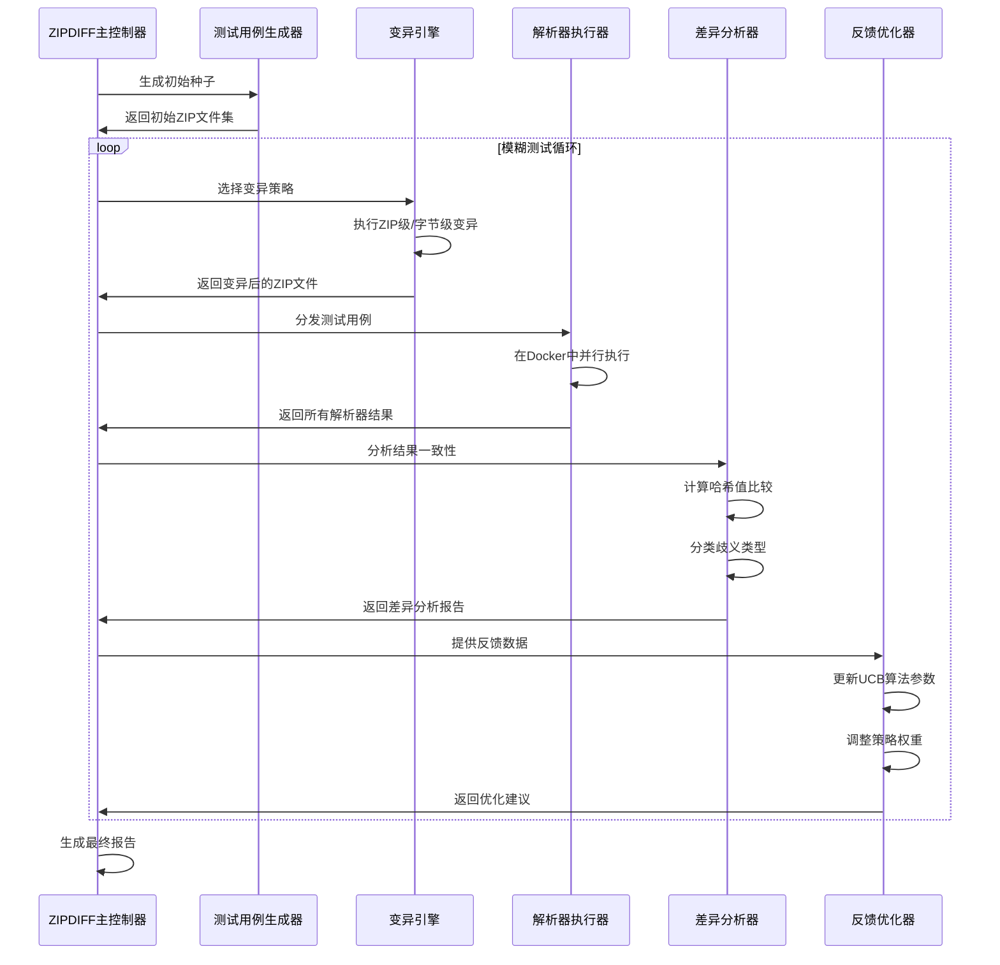
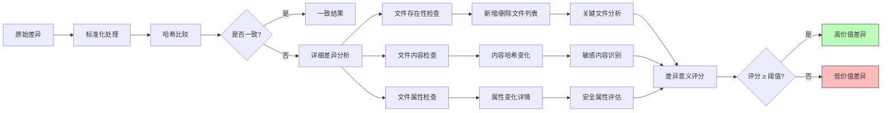

# Stage1: 选题与理解

## 第一周-11.04～11.20

### Target

- 弄清论文研究动机、核心问题与贡献点，搞清楚术语与范围；
- 精读论文摘要/引言/贡献；
- 列出研究问题与应用场景。

#### Detailed

1. 论文到底在解决什么安全问题，为什么重要？说清“ZIP 解析器语义差异”是啥、为什么会被攻击者利用。
2. ZIPDIFF整体流程是怎样的?
3. 如何判断“两个解析器结果不一致”是有意义的，而不是噪声或者是格式差异？
4. 真实影响有哪些场景？
5. 关键名词各是啥？LFH、CDH、EOCDR

### Deliverables

- 对论文的理解
- 问题清单

### Content

#### 1. 论文到底在解决什么安全问题，为什么重要？说清“ZIP 解析器语义差异”是啥、为什么会被攻击者利用

由于zip文件格式定义存在歧义，定义不够明晰，导致不同实现方式的zip解析器在解析同一个zip文件时会遵循不同的流程、方式，进而产生不同的解析结果。可以理解为zip规范的“方言”，复合标准规范的同时，有着自己的独特实现。这种差异往往是由程序员对zip规范的不同理解、不同实现导致的。

基于上面的原理，攻击者可以利用不同的zip“方言”，构造出一个zip文件，使其在不同的zip解析器中解析出不同的结果。比如文件共享工具使用的A解析器解析出正常文件，但是用户下载到本地后，使用B解析器解压时会解压出恶意文件。

另外，由于绝大多数的应用程序都不会自行实现zip解析器，而是依赖于操作系统或第三方库提供的zip解析器。这就存在供应链攻击的风险。供应链攻击不仅覆盖规模广，而且很难被排查出来。因此，论文的贡献在于发现了zip解析器语义差异这一安全问题，并对主流的解析库、解析器进行了测试，对差异类型进行了分类与评估。

#### 2. ZIPDIFF整体流程是怎样的?

#### 3. 如何判断“两个解析器结果不一致”是有意义的，而不是噪声或者是格式差异？

#### 4. 真实影响有哪些场景？

#### 5. 关键名词各是啥？LFH、CDH、EOCDR

### Questions
