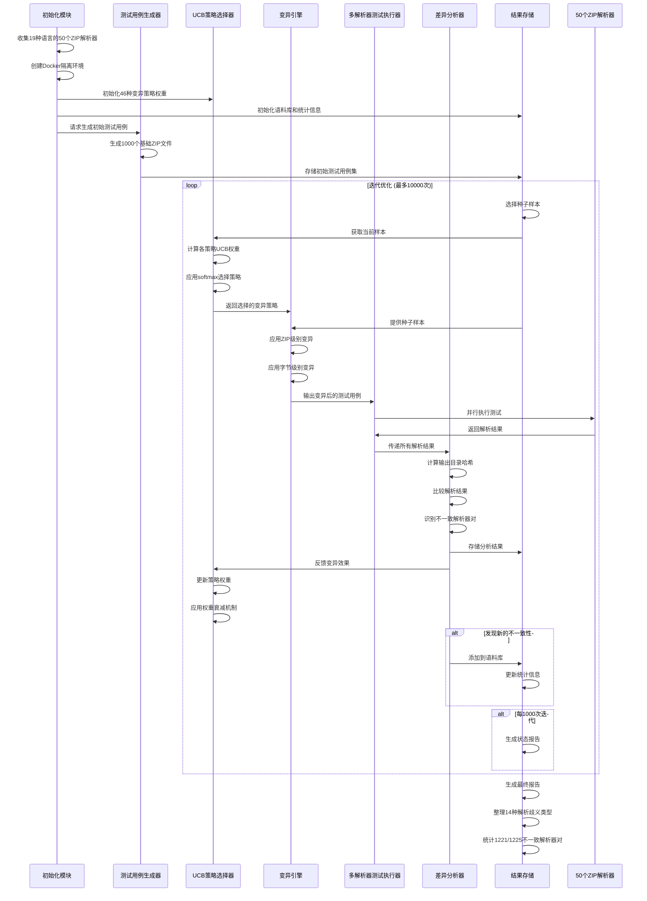
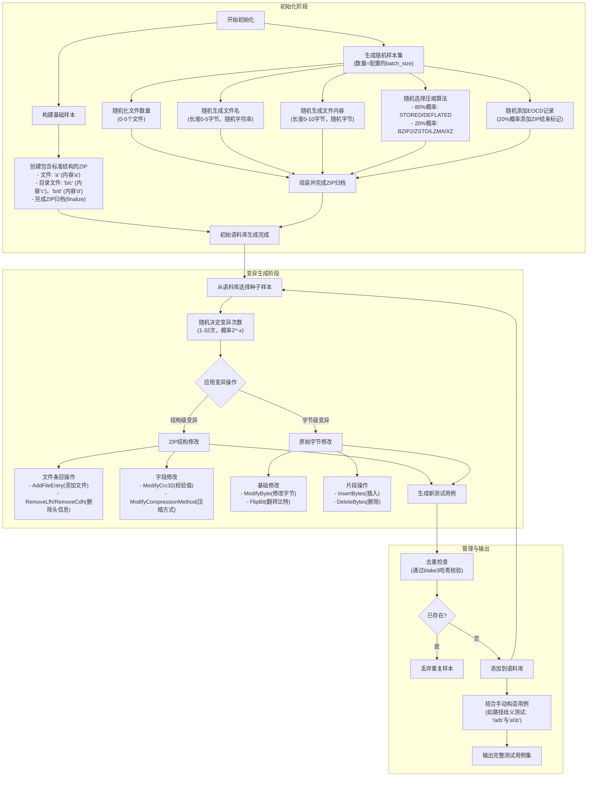
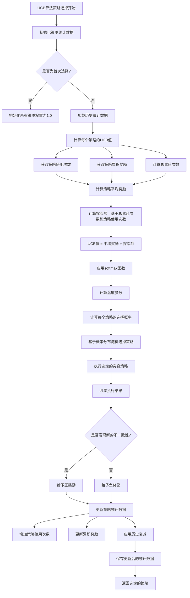
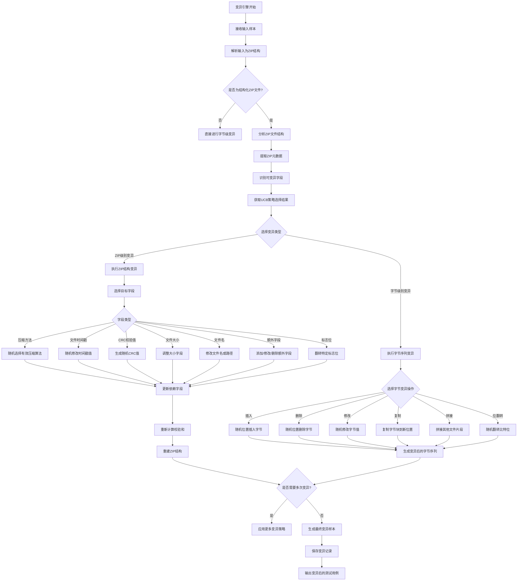
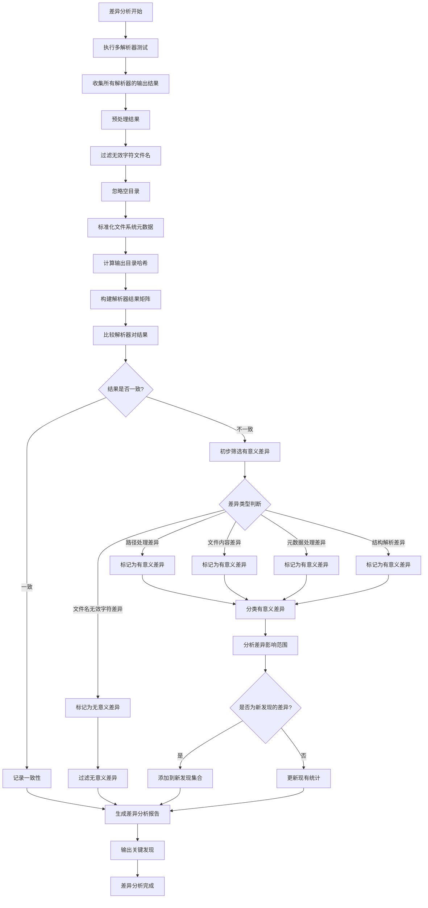

# Stage1-Week3

## Target

通读方法与实验部分，整理技术路线（差异检测→样本生成→多解析器对比）

### Detailed

- 学习理解ZIPDIFF的工作流程；

### Deliverables

详细的技术路线图 + 文字解释 + 讲解

## Content

### 工作流程概览

### 工作流程详细解释

#### 测试用例生成器

#### UCB策略选择器

#### 变异策略

##### Zip级变异

| 变异类别           | 具体变异方式       | 描述                             | 变异目标                             |
| ------------------ | ------------------ | -------------------------------- | ------------------------------------ |
| **压缩方法变异**   | 随机选择压缩算法   | 在有效的压缩算法中随机选择       | 本地文件头和中央目录头的压缩方法字段 |
|                    | 强制使用存储模式   | 将压缩方法设置为0（无压缩）      | 压缩方法字段                         |
|                    | 无效压缩方法测试   | 设置无效的压缩方法值             | 压缩方法字段                         |
| **时间戳变异**     | 随机修改时间戳     | 随机生成创建、修改、访问时间     | 各种时间戳字段                       |
|                    | 时间戳溢出测试     | 设置超出正常范围的时间值         | 时间戳字段                           |
|                    | 时间戳归零         | 将时间戳设置为0                  | 时间戳字段                           |
| **CRC校验变异**    | 随机CRC值          | 生成随机的CRC32校验值            | CRC校验字段                          |
|                    | CRC与数据不匹配    | 修改数据但保持原有CRC            | 数据字段或CRC字段                    |
| **文件大小变异**   | 随机调整大小值     | 修改文件大小字段但保持数据不变   | 压缩和未压缩大小字段                 |
|                    | 大小字段不匹配     | 使压缩大小大于未压缩大小         | 大小字段                             |
|                    | 超大文件大小       | 设置异常大的文件大小值           | 大小字段                             |
| **文件名变异**     | 随机字符替换       | 随机替换文件名中的字符           | 文件名字段                           |
|                    | 路径遍历序列       | 插入../等路径遍历字符            | 文件名字段                           |
|                    | 空文件名           | 将文件名设置为空字符串           | 文件名字段                           |
|                    | 超长文件名         | 创建超过255字符的文件名          | 文件名字段                           |
|                    | 特殊字符测试       | 插入Unicode或控制字符            | 文件名字段                           |
| **额外字段变异**   | 添加随机额外字段   | 插入随机的额外字段数据           | 额外字段区域                         |
|                    | 修改现有额外字段   | 改变已有的额外字段内容           | 额外字段                             |
|                    | 超大额外字段       | 创建异常大的额外字段             | 额外字段                             |
| **标志位变异**     | 随机翻转标志位     | 随机改变标志位的值               | 通用标志位字段                       |
|                    | 强制设置保留位     | 设置保留的标志位                 | 标志位字段                           |
|                    | 启用所有标志       | 设置所有可能的标志位             | 标志位字段                           |
| **中央目录变异**   | 目录与文件头不匹配 | 使中央目录与本地文件头信息不一致 | 中央目录条目                         |
|                    | 重复中央目录       | 创建重复的中央目录条目           | 中央目录                             |
|                    | 缺失中央目录       | 删除部分或全部中央目录           | 中央目录                             |
| **数据描述符变异** | 添加数据描述符     | 为没有描述符的文件添加描述符     | 数据描述符字段                       |
|                    | 修改数据描述符     | 改变现有数据描述符的内容         | 数据描述符                           |
| **跨字段依赖变异** | 破坏字段间一致性   | 修改一个字段但不更新相关字段     | 相互依赖的字段组                     |
|                    | 链式变异           | 同时修改多个相关字段             | 多个相关字段                         |

##### 字节级变异

| 变异类别         | 具体变异方式   | 描述                         | 变异目标       |
| ---------------- | -------------- | ---------------------------- | -------------- |
| **基本字节操作** | 随机字节修改   | 随机选择位置修改字节值       | 文件的任意位置 |
|                  | 字节插入       | 在随机位置插入一个或多个字节 | 文件的任意位置 |
|                  | 字节删除       | 从随机位置删除一个或多个字节 | 文件的任意位置 |
|                  | 字节复制       | 复制一段字节到另一个位置     | 文件的任意位置 |
|                  | 字节交换       | 交换文件中的两个字节块       | 文件的任意位置 |
| **位级操作**     | 随机位翻转     | 随机选择一个比特位并翻转     | 文件的任意位置 |
|                  | 连续位翻转     | 翻转连续的多个比特位         | 文件的任意位置 |
| **块操作**       | 块重复         | 将文件的一部分重复多次       | 文件的任意块   |
|                  | 块清零         | 将文件的一部分设置为0        | 文件的任意块   |
|                  | 块随机化       | 将文件的一部分替换为随机数据 | 文件的任意块   |
| **文件级操作**   | 文件截断       | 将文件截断到随机长度         | 文件末尾       |
|                  | 文件扩展       | 在文件末尾添加随机数据       | 文件末尾       |
|                  | 头部修改       | 修改文件的前N个字节          | 文件头部       |
|                  | 尾部修改       | 修改文件的后N个字节          | 文件尾部       |
| **特殊模式**     | 模式插入       | 插入特定的字节模式           | 文件的任意位置 |
|                  | 压缩数据变异   | 直接修改压缩数据             | 压缩数据区域   |
|                  | 元数据区域变异 | 专门针对元数据区域进行变异   | 文件元数据区域 |

#### 差异分析器

## Questions
